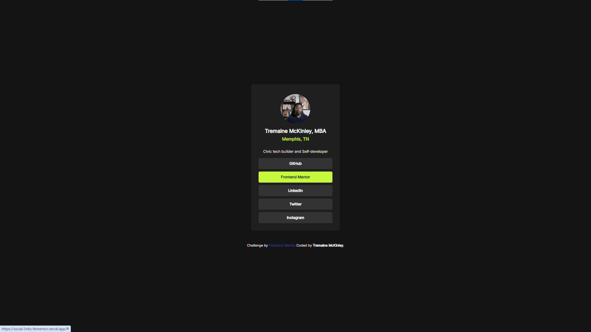

# Frontend Mentor - Social links profile solution

This is a solution to the [Social links profile challenge on Frontend Mentor](https://www.frontendmentor.io/challenges/social-links-profile-UG32l9m6dQ). Frontend Mentor challenges help you improve your coding skills by building realistic projects. 

## Table of contents

- [Overview](#overview)
  - [The challenge](#the-challenge)
  - [Screenshot](#screenshot)
  - [Links](#links)
- [My process](#my-process)
  - [Built with](#built-with)
  - [What I learned](#what-i-learned)
  - [Continued development](#continued-development)
  - [Useful resources](#useful-resources)
- [Author](#author)
- [Acknowledgments](#acknowledgments)

**Note: Delete this note and update the table of contents based on what sections you keep.**

## Overview

### The challenge
This design was completed using my working frontend knowledge along with the provided style guide and Figma file.
Part of the challenge was to meet both the functional and style requirement given to be through the design files.

Users should be able to:
- See hover and focus states for all interactive elements on the page

### Screenshot
Screenshot of live site with focus state showing on one element.




### Links

- Solution URL: [Add solution URL here](https://your-solution-url.com)
- Live Site URL: [Deployed with Vercel](https://social-links-fementor.vercel.app/)

## My process

### Built with

- Semantic HTML5 markup
- CSS custom properties
- Flexbox
- [Tailwind CSS](https://tailwindcss.com/) - CSS framework
- [React](https://reactjs.org/) - JS library
- [Next.js](https://nextjs.org/) - React framework

### What I learned

The challenge I gave myself for this lesson was to put my React skills to the test out of learning modules. This challenge could have been completed using HTML and CSS, but my goal is to build my JavaScript skills on the frontend.
My challenge began with step 1, initiating a working React app using Next.js. To to this, I read the documentation, reached out to friends for the best tools to learn with and committed to configuring a live site on my local server.
My final challenge came at the end when it was time to deploy the site to the web. Again, I took an example from a friend and decided on Vercel over GitHub pages and Surge, both of which I've used in the past for static pages. 

The coding challenge for me here was using a mix of vanilla CSS and Tailwind CSS in a way that looked clean. I took some high-leve styles and placed them in a CSS file, while some of the more fine-tuned spacing was done using Tailwind.

```
p {
    font-size: 12px;
} 
/* name */
h1 {
    font-size: 17px;
    font-weight: bold;
}
/* location */
h3 {
    font-size: 14px;
    padding: 2px;
    color:rgb(197 248 42 / 90%);
    font-weight: 600;
}
```

Most importantly, I was able to practice working off of a Figma file, which is a necessary skill for frontend builders.

### Continued development

I will continue building my understanding of the Next.js app structure and how to more properly mix Tailwind and vanilla CSS. I put a lot of time into figuring out how to mix the two here for this static site, but want to use a more conventional means on more complicated projects.

### Useful resources

- [Next deployment instructions](https://nextjs.org/docs/getting-started/installation) - Reading this documentation got me started. Understanding how to read documentation and learn of the fly is important in any tech-facing career. You can do it, face the challenge!

## Author

- Frontend Mentor - [@tremckinley](https://www.frontendmentor.io/profile/tremckinley)
- LinkedIn 👋 - [Let's connect!](https://www.linkedin.com/in/tremaine-mckinley)

## Acknowledgments

Thanks to Rob Crocker for the encouragement and assistance on this one! If not for the added motivation of sharing my work, I likely would have done just another HTML/CSS until I felt more "comfortable". Instead, I'm fired up! 🔥

